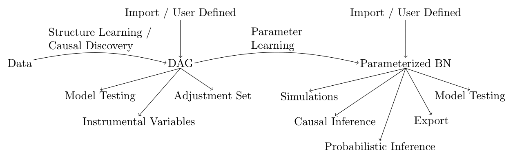

.. pgmpy documentation master file

:hide-toc:
:hide-navigation:

.. meta::
   :description: pgmpy documentation for Bayesian networks, causal discovery, parameter estimation, inference, and causal effect workflows in Python.

Welcome to pgmpy
================

.. grid:: 1 1 2 2
   :gutter: 3

   .. grid-item::
      :class: hero-logo-panel

      .. image:: _static/images/logo.png
         :alt: pgmpy logo
         :width: 220px
         :align: center

   .. grid-item::
      :class: hero-copy-panel

      .. class:: hero-subtitle

      *Python Library for Causal AI*

      pgmpy is a Python package for causal inference and probabilistic inference
      using Directed Acyclic Graphs (DAGs) and Bayesian Networks with a focus on
      modularity and extensibility. Implementations of various algorithms for
      causal discovery, parameter estimation, approximate inference, exact
      inference, and causal inference are available.

      .. container:: badge-container badge-container-left

         |pypi-badge| |conda-badge| |github-badge| |jmlr-badge|

Start Here
----------

.. grid:: 2 2 4 4
   :gutter: 3
   :class-container: sd-shadow-hover-cards

   .. grid-item-card:: Getting Started
      :link: started/index
      :link-type: doc
      :class-card: sd-card-hover

      Install pgmpy, run the quickstart, and get a first workflow running.

   .. grid-item-card:: Guides
      :link: documentation
      :link-type: doc
      :class-card: sd-card-hover

      Follow task-oriented guides for learning, inference, causal analysis, and model building.

   .. grid-item-card:: Examples
      :link: examples
      :link-type: doc
      :class-card: sd-card-hover

      Browse notebook-driven examples organized by workflow and model type.

   .. grid-item-card:: API Reference
      :link: reference
      :link-type: doc
      :class-card: sd-card-hover

      Jump directly to the public classes, functions, and modules.

Key Features
------------

.. grid:: 3
   :gutter: 3
   :class-container: sd-shadow-hover-cards

   .. grid-item-card:: Causal Discovery and Structure Learning
      :link: api/structure_learning
      :link-type: doc
      :class-card: sd-card-hover

      Learn causal structure from data.

   .. grid-item-card:: Parameter Estimation
      :link: api/parameter_estimation
      :link-type: doc
      :class-card: sd-card-hover

      Estimate model parameters with Maximum Likelihood, Bayesian estimation, or EM.

   .. grid-item-card:: Probabilistic Inference
      :link: api/inference
      :link-type: doc
      :class-card: sd-card-hover

      Run exact inference (Variable Elimination, Belief Propagation) or approximate
      inference (sampling, Gibbs).

   .. grid-item-card:: Causal Inference
      :link: api/causal_inference
      :link-type: doc
      :class-card: sd-card-hover

      Perform interventional and counterfactual queries using do-calculus, backdoor,
      and frontdoor adjustment.

   .. grid-item-card:: Causal Identification
      :link: guides/causal_identification
      :link-type: doc
      :class-card: sd-card-hover

      Determine whether a causal effect is identifiable from observational data
      given the graph structure.

   .. grid-item-card:: Example Datasets and Models
      :link: examples
      :link-type: doc
      :class-card: sd-card-hover

      Explore built-in example Bayesian Networks and datasets to quickly prototype
      and test workflows.

Workflow
--------

   Possible Workflows in pgmpy for Directed Acyclic Graphs (DAGs) and Bayesian Networks (BNs).

.. toctree::
   :hidden:

   Getting Started <started/index>
   Guides <documentation>
   Examples <examples>
   API Reference <reference>
   Citation <citation>
   Getting Involved <development>

.. |pypi-badge| image:: https://img.shields.io/pypi/v/pgmpy?style=flat-square&color=2E8B8E
   :alt: PyPI version
   :target: https://pypi.org/project/pgmpy/

.. |conda-badge| image:: https://img.shields.io/conda/vn/conda-forge/pgmpy?style=flat-square&color=2E8B8E
   :alt: Conda version
   :target: https://anaconda.org/conda-forge/pgmpy

.. |github-badge| image:: https://img.shields.io/github/stars/pgmpy/pgmpy?style=flat-square&color=2E8B8E
   :alt: GitHub stars
   :target: https://github.com/pgmpy/pgmpy

.. |jmlr-badge| image:: https://img.shields.io/badge/JMLR-2024-009688?style=flat-square
   :alt: JMLR 2024
   :target: http://jmlr.org/papers/v25/23-0487.html
