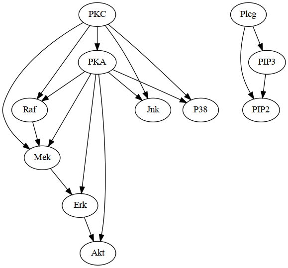
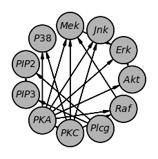
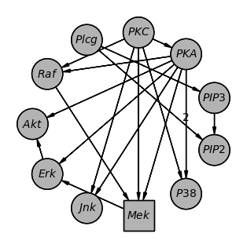

===============
Plotting Models
===============

pgmpy offers a few different ways to plot the model structure.

1. Using `pygraphviz` (https://pygraphviz.github.io/)
2. Using `networkx.drawing` module (https://networkx.org/documentation/stable/reference/drawing.html)
3. Using `daft` (https://docs.daft-pgm.org/)

1. Using `pygraphviz`
---------------------

`pygraphviz` is a Python wrapper to Graphviz that has a lot for functionality
for graph visualization. pgmpy provides a method to create a pygraphviz object from
Bayesian Networks and DAGs that can then be plotted using graphviz.

.. code-block:: python

   # Get an example model
   from pgmpy.utils import get_example_model
   model = get_example_model("sachs")

   # Convert model into pygraphviz object
   model_graphviz = model.to_graphviz()

   # Plot the model.
   model_graphviz.draw("sachs.png", prog="dot")

   # Other file formats can also be specified.
   model_graphviz.draw("sachs.pdf", prog="dot")
   model_graphviz.draw("sachs.svg", prog="dot")

The output `sachs.png` is shown below. Users can also tryout other layout methods supported by pygraphviz such as: `neato`, `dot`, `twopi`, `circo`, `fdp`, `nop`.

2. Using `daft`
---------------
Daft is a python package that uses matplotlib to render high quality plots suitable for publications.

.. code-block:: python

   # Get an example model
   from pgmpy.utils import get_example_model
   model = get_example_model("sachs")

   # Get a daft object.
   model_daft = model.to_daft()
   # To open the plot
   model_daft.render()
   # Save the plot
   model_daft.savefig('sachs.png')

   # Daft provides plenty of options for customization. Please refer DAG.to_daft documentation and daft's documentation.
   model_daft_custom = model.to_daft(node_pos='shell',
                                     pgm_params={'observed_style': 'shade', 'grid_unit': 3},
                                     edge_params={('PKA', 'P38'): {'label': 2}},
                                     node_params={'Mek': {'shape': 'rectangle'}})

The output of the two plots above.

3. Using `networkx.drawing`
---------------------------

Lastly, as both `pgmpy.models.BayesianNetwork` and `pgmpy.base.DAG` inherit `networkx.DiGraph`, all of networkx's drawing functionality can be directly used on both DAGs and Bayesian Networks.

.. code-block:: python

   import networkx as nx
   import matplotlib.pyplot as plt

   # Get an example model
   from pgmpy.utils import get_example_model
   model = get_example_model("sachs")

   # Plot the model
   nx.draw(model)
   plt.draw()
